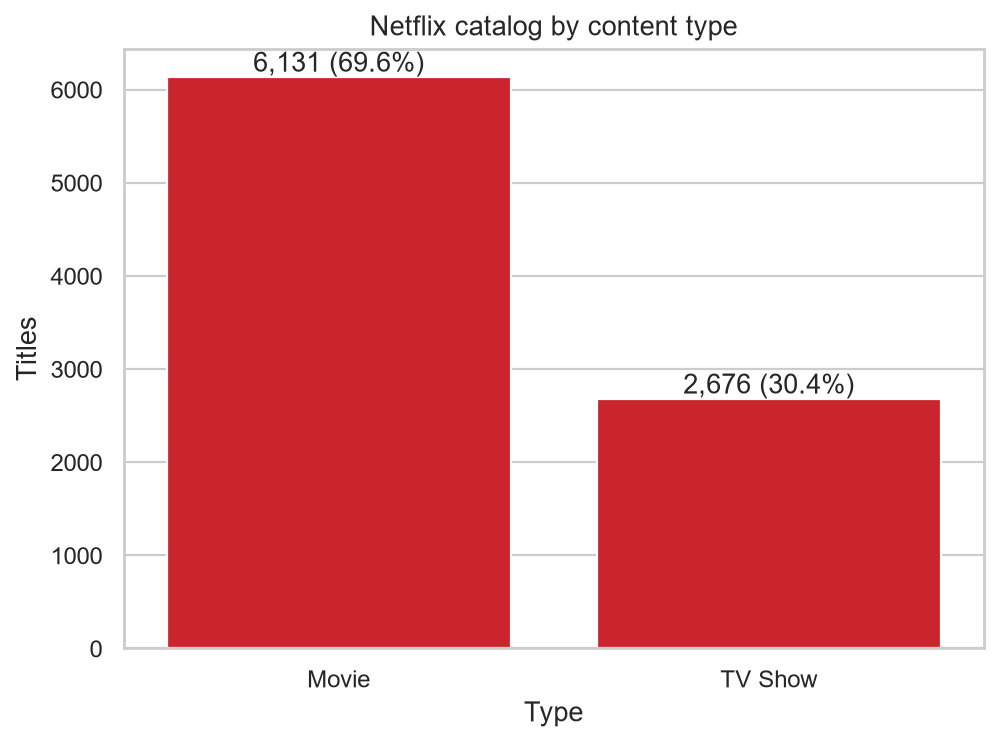
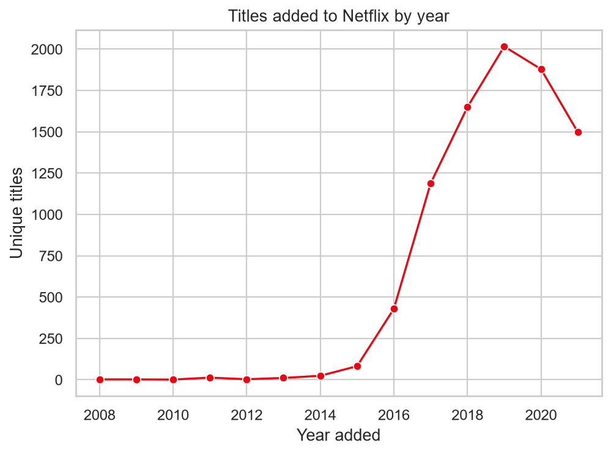
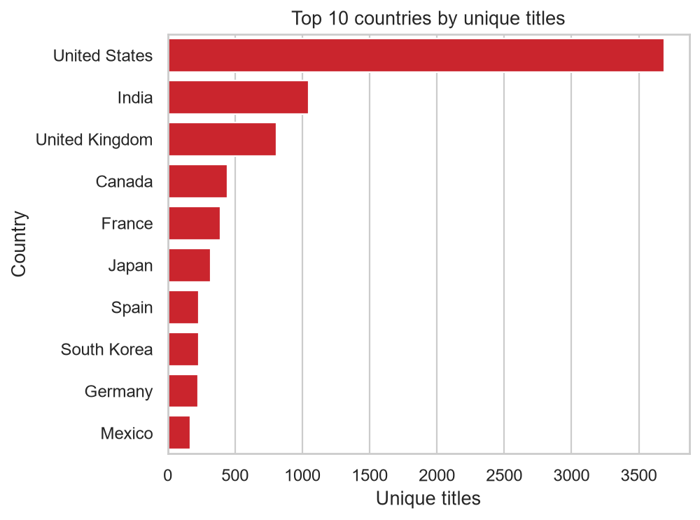
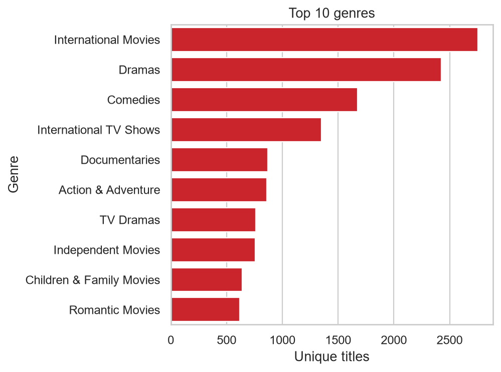
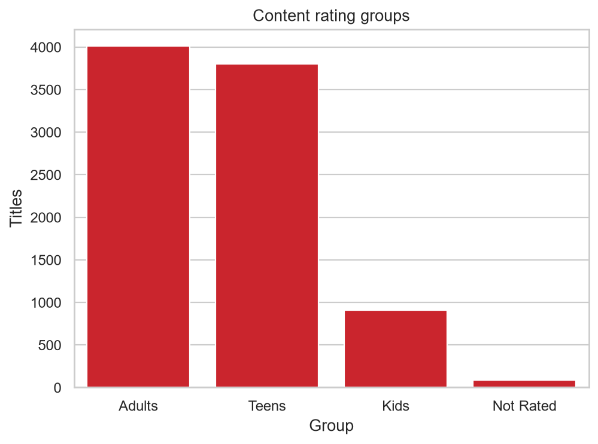
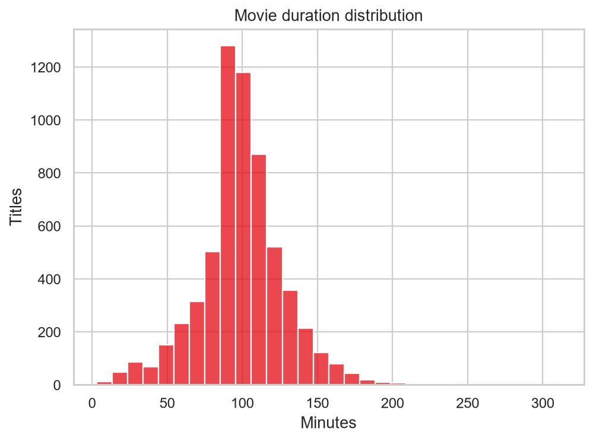
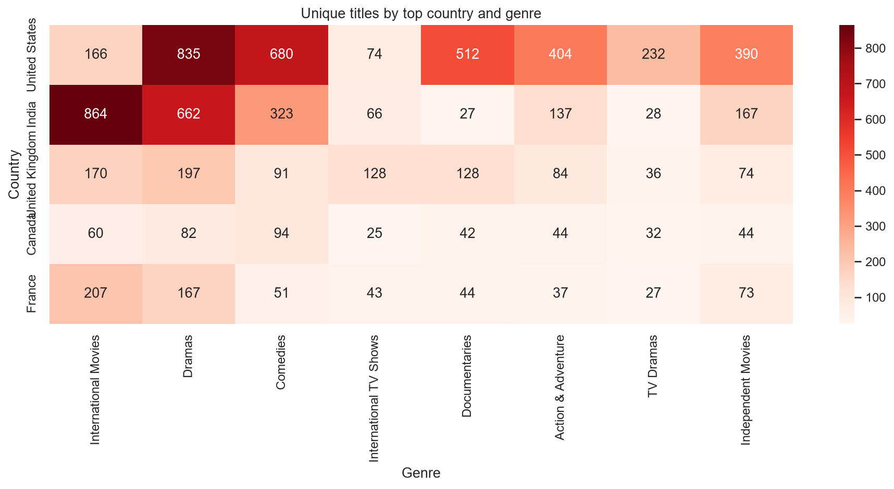

# Netflix Movies and TV Shows Analysis

## Problem statement
Explore the composition and recorded addition patterns of Netflix titles using Python. This project analyzes a public Kaggle catalog snapshot; it cannot tell us which titles people watched or liked.

## Dataset
Kaggle: [Netflix Movies and TV Shows](https://www.kaggle.com/datasets/shivamb/netflix-shows). The original `netflix_titles.csv` is stored under `data/raw/` and is never edited by the scripts.

## Tools
Python, Pandas, Matplotlib, Seaborn, Jupyter Notebook.

## Folder structure
```text
data/raw/            original CSV, unchanged
data/cleaned/        cleaned main table and exploded dimensions
notebooks/           full analysis notebook
src/                 reusable cleaning script
images/              exported charts
README.md
RESUME_AND_INTERVIEW.md
requirements.txt
```

## Data cleaning
Run `python src/clean_data.py` or run the notebook. The workflow trims text, removes exact duplicate rows, retains titles with missing director/cast/country by labeling those values `Unknown`, parses dates and durations, repairs duration-like values accidentally placed in rating, adds date/duration/rating/content-age fields, and writes one-row-per-dimension country, genre, cast, and director files. Exploded files are designed for dimension counts; use distinct `show_id` when counting titles. Ratings are grouped into Kids, Teens, Adults, and Not Rated. `Not Rated` includes missing and values outside the documented mapping.

### Cleaning summary (computed from the supplied CSV)

| Measure | Before | After |
|---|---:|---:|
| Rows | 8,807 | 8,807 |
| Exact duplicates removed | — | 0 |
| Values detected as misplaced durations in rating | — | 3 |

Missing values by column (before → after):

- `show_id`: 0 → 0
- `type`: 0 → 0
- `title`: 0 → 0
- `director`: 2,634 → 0
- `cast`: 825 → 0
- `country`: 831 → 0
- `date_added`: 10 → 10
- `release_year`: 0 → 0
- `rating`: 4 → 7
- `duration`: 3 → 0
- `listed_in`: 0 → 0
- `description`: 0 → 0

## Key insights (computed from this CSV)

- The catalog contains **8,807 titles**: 6,131 Movies (69.6%) and 2,676 TV Shows (30.4%).
- **2,016 titles** were added in 2019, the peak recorded year.
- July was the busiest month, with **827 titles** added.
- United States was the top country (**3,690 titles**); India was second (**1,046**).
- The leading genre was **International Movies** (2,752 titles).
- **45.5%** of titles are in the Adults rating group under this project's documented mapping.
- Movie runtime averaged **99.6 minutes**; the median was **98.0 minutes**. Median content age at addition was **1.0 years**.
- The most frequent named director was **Rajiv Chilaka** (22 titles); the most frequent named cast member was **Anupam Kher** (43 titles).
- India's recorded additions peaked in 2018 (349 titles). These are catalog metadata counts, not audience demand.

## Charts
The notebook was run end-to-end and saved all charts in `images/`.









## Run it
1. Install Python 3.10 or newer.
2. From this folder run `pip install -r requirements.txt`.
3. Start Jupyter with `jupyter notebook` and open `notebooks/netflix_analysis.ipynb`.
4. Run all cells from top to bottom.

## Limitations
This dataset is a snapshot; it has no viewership, ratings/reviews, revenue, or licensing cost data, so popularity and business performance cannot be measured. Multi-value metadata can overlap. Recorded addition year is not the same as release year or current availability.

## Future improvements
Join a licensed IMDb ratings dataset, add content costs and viewing metrics if available, or build a Power BI dashboard from `data/cleaned/netflix_cleaned.csv`.
